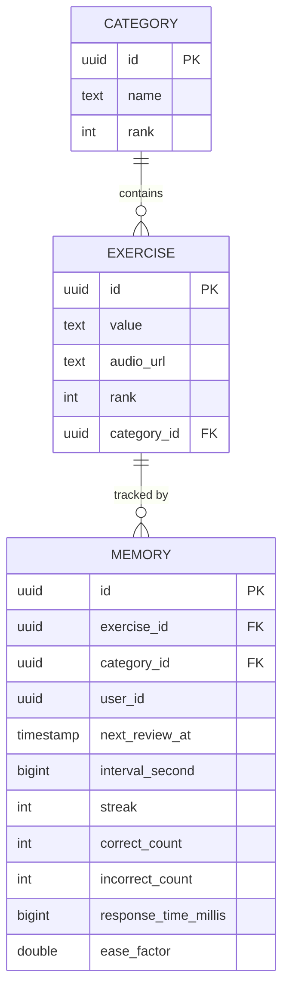

# OpenElifba

[](https://github.com/wordiam/openelifba/actions/workflows/publish.yml)
[](https://kotlinlang.org)
[](https://spring.io/projects/spring-boot)
[](https://opensource.org/licenses/MIT)

**OpenElifba** is an open-source vocabulary learning and spaced repetition application built with Kotlin and Spring Boot. It implements a scientifically-proven spaced repetition algorithm to help users efficiently memorize vocabulary, letters, and other learning materials.

## ✨ Features

- 📚 **Spaced Repetition System (SRS)** - Adaptive learning intervals based on performance
- 🎯 **Category-based Learning** - Organize exercises into logical categories
- 📊 **Progress Tracking** - Detailed statistics including accuracy, response time, and streaks
- 🔄 **Ease Factor Algorithm** - Personalized difficulty adjustment based on user performance
- 🏗️ **Clean Architecture** - Hexagonal/DDD architecture for maintainability

## 🏛️ Architecture

OpenElifba follows **Hexagonal Architecture** (Ports & Adapters) with Domain-Driven Design principles:

```
src/main/kotlin/com/wordiam/openelifba/
├── domain/           # Core business logic (no framework dependencies)
│   ├── category/     # Category entity, value objects, services
│   ├── exercise/     # Exercise entity and value objects
│   ├── memory/       # Memory entity (SRS algorithm)
│   ├── port/         # Interface definitions (Fetchers, Upserters, Finders)
│   └── time/         # Time abstraction for testability
├── application/      # Use cases that orchestrate domain logic
│   ├── GetCategoriesUseCase.kt
│   ├── GetDueExercisesUseCase.kt
│   └── UpdateMemoryUseCase.kt
└── infra/            # Framework & external integrations
    ├── controller/   # REST API endpoints
    ├── repository/   # jOOQ database implementations
    └── config/       # Spring configuration
```

## 🚀 Quick Start

### Prerequisites

- **Java 21** or later
- **Docker** (for PostgreSQL)
- **Gradle 8.x** (or use the included wrapper)

### Setup

1. **Clone the repository**
   ```bash
   git clone https://github.com/wordiam/openelifba.git
   cd openelifba
   ```

2. **Start the PostgreSQL database**
   ```bash
   docker-compose up -d
   ```

3. **Run database migrations and generate jOOQ classes**
   ```bash
   ./gradlew flywayMigrate generateJooq
   ```

4. **Run the application**
   ```bash
   ./gradlew bootRun
   ```

The API will be available at `http://localhost:8080`.

### Running Tests

```bash
# Run all tests (requires Docker for TestContainers)
./gradlew test

# Run with detailed output
./gradlew test --info

# Run code quality checks
./gradlew ktlintCheck detekt
```

## 📡 API Overview

### Categories

```bash
# Get all categories with statistics
curl -H "x-user-id: <your-uuid>" http://localhost:8080/api/categories
```

### Exercises

```bash
# Get due exercises for a category
curl -H "x-user-id: <your-uuid>" http://localhost:8080/api/categories/<category-id>/exercises
```

### Memory Updates

```bash
# Record a review result
curl -X POST http://localhost:8080/api/memory \
  -H "Content-Type: application/json" \
  -H "x-user-id: <your-uuid>" \
  -d '{
    "categoryId": "<category-uuid>",
    "exerciseId": "<exercise-uuid>",
    "success": true,
    "responseTimeMillis": 2500
  }'
```

## 🛠️ Technology Stack

| Component | Technology |
|-----------|------------|
| Language | Kotlin 1.9.23 |
| Framework | Spring Boot 3.2.5 |
| Database | PostgreSQL 17 |
| Query Builder | jOOQ 3.18.14 |
| Migrations | Flyway |
| Testing | JUnit 5, TestContainers, MockK |
| Code Quality | Detekt, ktlint |
| Build Tool | Gradle 8.x (Kotlin DSL) |
| Container | Docker |
| CI/CD | GitHub Actions |

## 🧮 Spaced Repetition Algorithm

OpenElifba uses an enhanced SM-2 based algorithm with dynamic ease factor adjustment:

- **Ease Factor Range**: 1.3 to 3.5 (default: 2.5)
- **Performance Adjustments**:
  - Fast correct (< 3s): +0.15 bonus
  - Normal correct (3-10s): +0.10 bonus
  - Slow correct (> 10s): +0.05 bonus
  - Incorrect: -0.20 penalty
- **Interval Calculation**: `newInterval = currentInterval × easeFactor`

## 📁 Database Schema



## 🤝 Contributing

We welcome contributions! Please see [CONTRIBUTING.md](CONTRIBUTING.md) for guidelines.

### Development Setup

1. Fork the repository
2. Create a feature branch (`git checkout -b feature/amazing-feature`)
3. Make your changes
4. Run tests and quality checks (`./gradlew test ktlintCheck detekt`)
5. Commit your changes (`git commit -m 'Add amazing feature'`)
6. Push to the branch (`git push origin feature/amazing-feature`)
7. Open a Pull Request

## 📋 Project Status

OpenElifba is actively maintained. See the [GitHub Issues](https://github.com/wordiam/openelifba/issues) for current tasks and feature requests.

## 📄 License

This project is licensed under the MIT License - see the [LICENSE](LICENSE) file for details.

## 🙏 Acknowledgments

- Inspired by the SuperMemo SM-2 algorithm
- Built with the excellent Spring Boot ecosystem
- Powered by jOOQ for type-safe SQL
